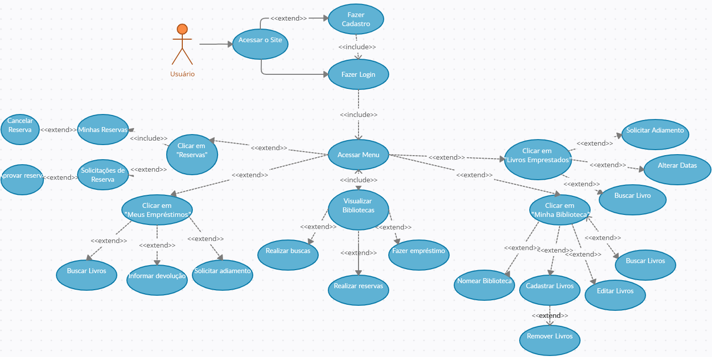

# Especificações do Projeto
## Personas

Ana Guimarães Santos. Ana é uma mulher de 35 anos, estudante de administração no oitavo período em uma faculdade particular na capital e faz estágio em uma empresa, além de estudar para concurso público, que é o seu sonho. Ela tem como seu principal lazer a leitura. Amante de histórias de romances e leitora assídua sobre processos administrativos e legislação, sempre está à procura de novos livros.

Marlene Soares Almeida. Marlene é uma mulher de 42 anos, mãe de 3 crianças: Mariana com 14 anos, Pedro com 10 e Valentina com 7 meses. Ela tem procurado incentivar a leitura de seus filhos, por isso faz várias aquisições de livros para os seus filhos. Marlene acaba tendo que comprar muitos livros, pelo rápido crescimento e falta de interesse dos filhos por certos assuntos. Com muita dificuldade consegue trocar os livros, tendo que procurar em diversos grupos de redes sociais ou amigos.

João Henrique da Silva Souza. João é um homem de 34 anos, trabalha como analista de dados há 4 anos em uma startup e tem pretensão de crescer na área, é sua paixão. Consome muitos livros técnicos da área de informática. Sua biblioteca pessoal é extensa. Como os conhecimentos técnicos sobre informática sempre mudam, com as novidades do mundo tecnológico surgindo todos os dias, ele precisa encontrar pessoas para poder compartilhar os seus livros e encontrar novos, que ainda não leu.

Marcelo Marques. É um homem de 51 anos, trabalha como Analista Administrativo. Ao longo de sua vida ele foi adquirindo livros tanto para conhecimento em áreas que ele gosta e tem interesse em estudar e também para entretenimento. Os motivos que levam para utilizar o sistema é que tem uma quantidade grande de livros e deseja incentivar outras pessoas a lerem outros livros. A principal frustração é o espaço físico que os livros ocupam e que está difícil achar alguém interessado em adquiri-los.

Aline de Moura. Uma mulher de 36 anos de idade, trabalha como Cientista de Dados. Aline, utiliza muito da leitura como uma forma de descansar a mente e fugir da rotina corrida. Sua motivação é principalmente sanar o seu desejo de leitura com diversos tipos e assuntos. A frustração de Aline é gostar do livro físico e não ter espaço em casa para adquirir mais livros do que ela já tem e outra coisa é que as bibliotecas têm ficado cada vez mais escassas.

Gabriela Fernandes. Uma mulher de 46 anos de idade, atualmente trabalha  em uma multinacional. Gabriela desde cedo gosta muito de ler livros, principalmente para distrair a cabeça em momentos difíceis. Motivos para usar a aplicação é um modo acessível para conseguir livros que ela interessa e fica receosa de comprar, prefere ler livro físico do que virtual. Na empresa ela lê bastante documentos e livros para auxiliar no trabalho e com a aplicação ela poderia conhecer pessoas com os mesmo gostos. Sua frustração é que os preços dos livros físicos estão bastante altos.

Thiago Braga. Professor de história há mais de 15 anos e um amante da história de guerra medieval, coleciona inúmeras obras deste enorme período. Como um professor, ele adora cativar as pessoas a pesquisarem, lerem e estudarem mais sobre os assuntos. O principal motivo para usar a aplicação seria de emprestar seus livros para curiosos leitores e também pôr em mãos, livros que ainda não havia comprado.

Clóvis Salgado. Um senhor de idade, tem uma grande coleção de livros, ele fica com dificuldades para organizar sua biblioteca e queria uma forma automatizada para organizar sua estimada coleção. 

## Histórias de Usuários

Com base na análise das personas forma identificadas as seguintes histórias de usuários:

|EU COMO... `PERSONA`| QUERO/PRECISO ... `FUNCIONALIDADE` |PARA ... `MOTIVO/VALOR`                 |
|--------------------|------------------------------------|----------------------------------------|
|Ana Guimarães Santos  | Um sistema que me ajude a encontrar novos livros. | Quero livros para estudar e ter o meu momento de lazer               |
|Marlene Soares Almeida | Algo que facilite a troca de livros com outras pessoas.| Procuro incentivar a leitura de meus filhos |
|João Henrique da Silva Souza|Preciso encontrar pessoas para compartilhar os livros mais facilmente. |Desejo encontrar livros dos quais ele ainda não leu.|
|Marcelo Marques |Possuo uma grande quantidade de livros e desejo organizar seus livros.|Desejo incentivar outras pessoas a lerem os livros e compartilhar com quem tem interesse.|
|Aline de Moura|Quero um lugar onde eu possa encontrar novos livros para pegar emprestado.|Desejo sanar o meu desejo de leitura com diversos tipos e assuntos|
|Gabriela Silva Fernandes|Quero um lugar onde conseguir livros físicos sem ter que pagar.|Quero pegar livros emprestados para que eu possa ler sem ter que pagar muito caro.|
|Thiago Braga|Quero emprestar meus livros para curiosos leitores|Como professor, adoro cativar as pessoas a pesquisarem, lerem e estudarem mais sobre os assuntos|
|Clóvis Salgado|Quero organizar minha biblioteca |Tenho problemas de locomoção e não quero ter que gastar muito tempo para isso.|

## Requisitos

As tabelas que se seguem apresentam os requisitos funcionais e não funcionais que detalham o escopo do projeto.

### Requisitos Funcionais

|ID    | Descrição do Requisito  | Prioridade |
|------|-----------------------------------------|----|
|RF-001| O sistema deve ter uma tela inicial para realização de login.| ALTA | 
|RF-002| O sistema deve ter na tela inicial opção para cadastramento| ALTA |
|RF-003|O sistema deve possuir um menu lateral interativo para que o usuário navegue nas funcionalidades: Bibliotecas, Minha Biblioteca, Livros Emprestados, Meus Empréstimos, Reservas| ALTA |
|RF-004|O sistema deverá possuir uma sessão de bibliotecas, onde o usuário visualiza livros de outras bibliotecas e fará reservas e empréstimo| ALTA |
|RF-005|Deve ter na tela das Bibliotecas: campo para busca, listagem dos livros com opção para realizar reservas e fazer empréstimo| ALTA |
|RF-006|O sistema deverá possuir uma sessão de minha biblioteca, onde o usuário conseguirá cadastrar seus livros, editar ou removê-los| ALTA |
|RF-007|Deve ter na tela Minha Biblioteca: campo para busca, campo do nome da biblioteca, listagem dos livros com opção para: cadastro, edição e remoção| ALTA |
|RF-008|O sistema deverá possuir uma sessão de meus empréstimos onde o usuário controlará os livros que ele pegou emprestado com outros usuários| ALTA |
|RF-009|Deve ter na tela Meus Empréstimos: campo para busca, informar devolução e solicitar adiamento| ALTA |
|RF-010|O sistema deverá possuir uma sessão de livros emprestados onde o usuário controlará os livros que ele emprestou a outros usuários| ALTA |
|RF-011|Deve ter na tela Livros Emprestados: campo para busca, solicitar devolução, alterar data devolução| ALTA |
|RF-012|Deve ter na tela Reservas, a listagem das Minhas Reservas e Solicitações de Reservas| ALTA |
|RF-013|O sistema deverá possuir uma sessão de minhas reservas, onde o usuário visualiza reservas solicitadas por ele| ALTA |
|RF-014|Deve ter na tela Minhas Reservas: cancelar reserva| ALTA |
|RF-015|O sistema deverá possuir uma sessão de solicitações de reservas, onde o usuário visualiza reservas solicitadas por outro usuários| ALTA |
|RF-016|Deve ter na tela Solicitações de Reservas: aprovar reserva| ALTA |
|RF-017|Deve ter tela para atualização cadastral| BAIXA |

### Requisitos não Funcionais

|ID     | Descrição do Requisito  |Prioridade |
|-------|-------------------------|----|
|RNF-001|Os livros deverão ser apresentados em blocos para facilitar a visualização dos títulos| ALTO | 
|RNF-002|Serão exibidos no máximo 20 livros por pesquisa/exibição|  ALTO | 
|RNF-003|Os livros deverão ter Título, Autor, Código Bibliométrico, ISBN, ano de publicação e edição|  ALTO | 
|RNF-004|O sistema deve permitir o cadastro de livros em 1 minuto|  ALTO | 
|RNF-005|O sistema deve ser capaz de apresentar as tabelas com os livros de forma eficiente|  ALTO | 
|RNF-006|O sistema deverá funcionar em todos os sistemas operacionais|  ALTO | 
|RNF-007|Nas Bibliotecas, na listagem dos livros|  ALTO | 
|RNF-008|Todos os inputs devem respeitar o tipo e tamanho do campo do Banco de Dados|  ALTO | 

## Restrições

O projeto está restrito pelos itens apresentados na tabela a seguir.

|ID| Restrição                                             |
|--|-------------------------------------------------------|
|01|O site deve ser construído por alunos da Turma 3, Grupo 3, do curso TECNOLOGIA EM ANÁLISE E DESENV. DE SISTEMAS, turno VIRTUAL, desta Pontifícia Universidade Católica de Minas Gerais - CNPJ 17.178.195/0014-81, 2° semestre de 2022.|
|02|A data de entrega do projeto não poderá exceder a data 11/12/2022.|
|03|O site deve ser publicado no GitHub.|
|04|O banco de dados utilizado deverá ser o SQL Server.|
|05|O sistema deverá ser desenvolvido utilizando a linguagem de programação C#|
|06| Deverá ser utilizado o Entity Framework para auxiliar na construção da interface|

Enumere as restrições à sua solução. Lembre-se de que as restrições geralmente limitam a solução candidata.

## Diagrama de Casos de Uso

